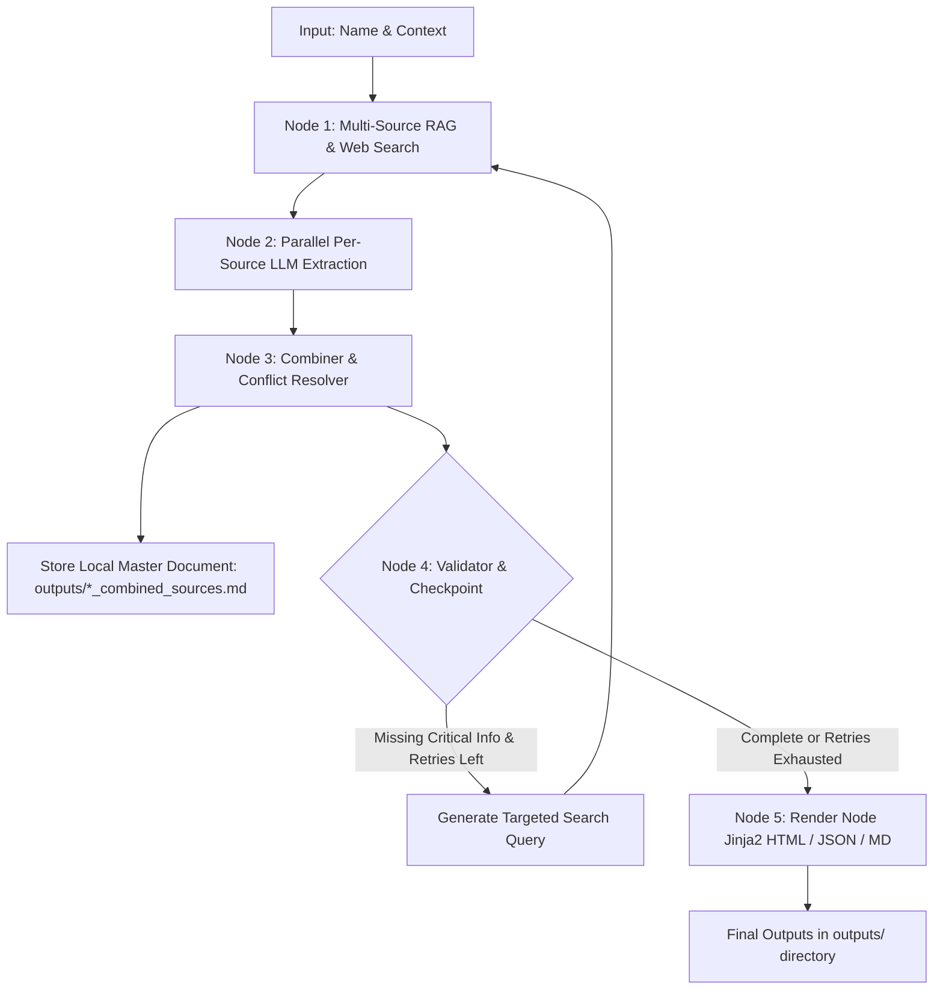

# AI-Powered Executive Profile Generator (LangGraph Orchestration)

An end-to-end AI agentic workflow built with **LangGraph**, **Pydantic Structured Outputs**, and **Multi-Source RAG Retrieval** to generate structured, professional profiles of affluent individuals from publicly available information.

---

## 🏗️ Architecture & AI Workflow

The application uses an orchestrated **5-node state graph (`StateGraph`)** that separates retrieval, per-source structured extraction, conflict-resolving synthesis, quality validation with loopback retries, and high-fidelity rendering:



### Key AI Engineering Approaches Demonstrated:
1. **Multi-Source Retrieval (Hierarchy of Trust):**
   - Retrieves authoritative biographical and photo data from **Wikipedia**.
   - Retrieves financial metrics (estimated net worth), recent news, and corporate leadership details using **DuckDuckGo Web Search** and **Forbes/News targeting**.
2. **Parallel Per-Source Extraction (`SourceExtract` Schema):**
   - Each retrieved source is independently processed by an LLM with strict **Pydantic structured output validation**.
   - Enforces zero-hallucination (`"Not found"` or `null` if explicitly absent from the snippet).
3. **Combiner & Conflict Resolution (`combine_node.py`):**
   - Synthesizes extracted facts across all sources.
   - **Local Document Generation:** Automatically generates and stores a master raw document (`outputs/<name>_combined_sources.md`) containing all retrieved raw snippets and individual source extractions.
   - **Conflict Handling:** Explicitly highlights discrepancies across sources (e.g., *"Forbes reported $1.8B as of 2024, whereas Wikipedia cited $2.0B as of May 2025"*).
4. **Validation Checkpoint & Loopback (`validate_node.py`):**
   - Verifies completeness of critical fields (`executive_summary`, `estimated_net_worth`, `career_timeline`, `education`).
   - If key data is missing and retry attempts remain (`max_retries=2`), generates targeted follow-up queries (`"<name> net worth Forbes exact figure"`) and loops back to retrieval.
5. **High-Fidelity Rendering (`render_node.py` & Jinja2):**
   - Renders a responsive, visually polished HTML profile (`outputs/<name>_profile.html`) inspired by modern executive sheets, alongside structured `.json` and `.md` formats.

---

## 🚀 Setup & Execution Instructions

### 1. Prerequisites
- Python 3.10+
- An API key for Google Gemini (`GOOGLE_API_KEY` or `GEMINI_API_KEY`) **OR** OpenAI (`OPENAI_API_KEY`).

### 2. Installation
Clone the repository and install dependencies:
```bash
cd profile_agent
pip install -r requirements.txt
```

### 3. Environment Configuration
Create a `.env` file in the root of `profile_agent/` (or export in shell):
```env
# If using Google Gemini (Recommended / Default)
GOOGLE_API_KEY="your-google-api-key"
# OR GEMINI_API_KEY="your-google-api-key"

# If using OpenAI
# OPENAI_API_KEY="your-openai-api-key"
```

### 4. Running via CLI (`main.py`)
Run the entry point with the target individual's name and context:
```bash
python main.py "Satya Nadella" "CEO of Microsoft"
```
Or for other individuals:
```bash
python main.py "Sundar Pichai" "CEO of Alphabet and Google"
python main.py "Jensen Huang" "CEO of NVIDIA"
```

### 5. Running via Streamlit Web UI (`app.py`)
Launch the interactive web interface:
```bash
streamlit run app.py
```
Open `http://localhost:8501` in your browser to enter names, view the step-by-step agent execution, and inspect/download the rendered HTML profiles, JSON data, and local combined documents.

---

## 📁 Project Structure
```text
profile_agent/
├── main.py               ← CLI entry point
├── app.py                ← Streamlit interactive frontend
├── graph.py              ← LangGraph StateGraph definition & edge wiring
├── nodes/
│   ├── __init__.py
│   ├── search_node.py    ← Multi-source RAG search (Wikipedia + DuckDuckGo/Forbes)
│   ├── extract_node.py   ← Per-source LLM extraction (with Pydantic validation)
│   ├── combine_node.py   ← Combiner LLM + local combined doc generator
│   ├── validate_node.py  ← Checkpoint + conditional loopback logic
│   └── render_node.py    ← Jinja2 HTML, Markdown, and JSON renderers
├── models/
│   ├── __init__.py
│   └── profile.py        ← Pydantic schemas (SourceExtract & FinalProfile)
├── templates/
│   └── profile.html      ← Responsive executive profile Jinja2 template
├── outputs/              ← Generated profile artifacts land here
├── requirements.txt
└── README.md
```
